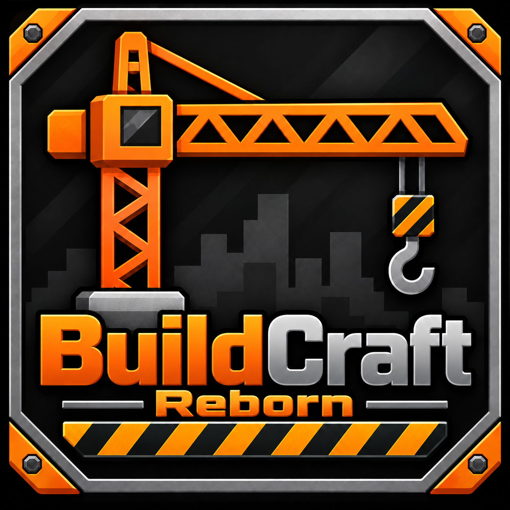

# BuildCraft Reborn

<p align="center"></p>

Port não oficial do **BuildCraft 8** para o Minecraft moderno (**Fabric 26.2**): tubos, motores, pedreira,
bombas, refino de petróleo, portas lógicas e construtores, com o sistema de energia
[Craft Energy](https://github.com/FP-Tainan/CraftEnergy) (CW, MV, RA, CWh) no lugar do MJ.

Unofficial port of **BuildCraft 8** to modern Minecraft (**Fabric 26.2**): pipes, engines, quarry, pumps,
oil refining, gates and builders, using the [Craft Energy](https://github.com/FP-Tainan/CraftEnergy)
power system (CW, MV, RA, CWh) instead of MJ.

## O que tem / Features

- Motores de redstone, Stirling, combustão e criativo / Redstone, Stirling, combustion and creative engines
- Tanque, bomba, poço de mineração, comporta e bancada automática / Tank, pump, mining well, flood gate and auto workbench
- Pedreira e preenchedor com marcadores / Quarry and filler with land marks
- Tubos de itens e fluidos, tubos especiais (lápis, daizuli, madeira-diamante, emzuli, stripes), lentes, filtros, buffer filtrado e fachadas / Item and fluid pipes, special pipes, lenses, filters, filtered buffer and facades
- Petróleo no mundo, combustíveis, destilador e trocador de calor / Oil generation, fuels, distiller and heat exchanger
- Laser, mesa de montagem e mesa de trabalho avançada / Laser, assembly table and advanced crafting table
- Portas lógicas, fios de tubo, pulsar, temporizador e sensor de luz / Gates, pipe wires, pulsar, timer and light sensor
- Mesa do arquiteto, construtor, biblioteca eletrônica e substituidor / Architect table, builder, electronic library and replacer
- Livro guia e conquistas em português e inglês / Guide book and advancements in Portuguese and English

Requer / Requires: Fabric API e / and [Craft Energy](https://github.com/FP-Tainan/CraftEnergy).
Plano e histórico / Roadmap: [docs/ROADMAP.md](docs/ROADMAP.md).

## Créditos / Credits

O BuildCraft original foi criado por **SpaceToad** e mantido pela **BuildCraft Team**:
https://www.mod-buildcraft.com/

The original BuildCraft was created by **SpaceToad** and maintained by the **BuildCraft Team**.
This project is not affiliated with or endorsed by the BuildCraft Team.

Port: Tainan Fermino Peres

## Licença / License

Como o BuildCraft, este projeto usa a **Minecraft Mod Public License 1.0.1** ([LICENSE](LICENSE)).
O código-fonte fica público e gratuito, e as partes derivadas do BuildCraft continuam sob a MMPL.

Like BuildCraft, this project is licensed under the **Minecraft Mod Public License 1.0.1**.

## Como compilar / Building

O Craft Energy precisa estar clonado na pasta ao lado, com o nome `craft-energy`.
Craft Energy must be cloned next to this project, named `craft-energy`.

```bash
git clone https://github.com/FP-Tainan/CraftEnergy.git craft-energy
git clone https://github.com/FP-Tainan/BuildCraft-Reborn.git BuildCraft-Reborn
cd BuildCraft-Reborn
./gradlew build
```
